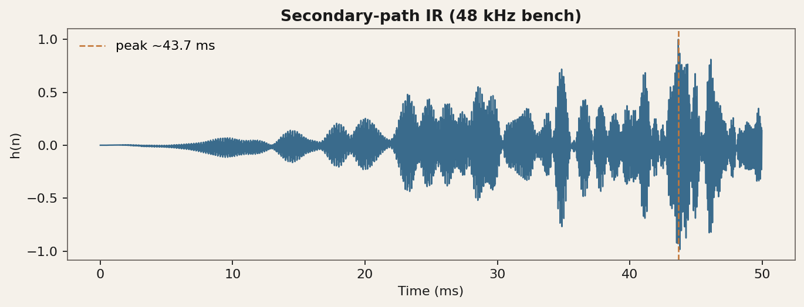
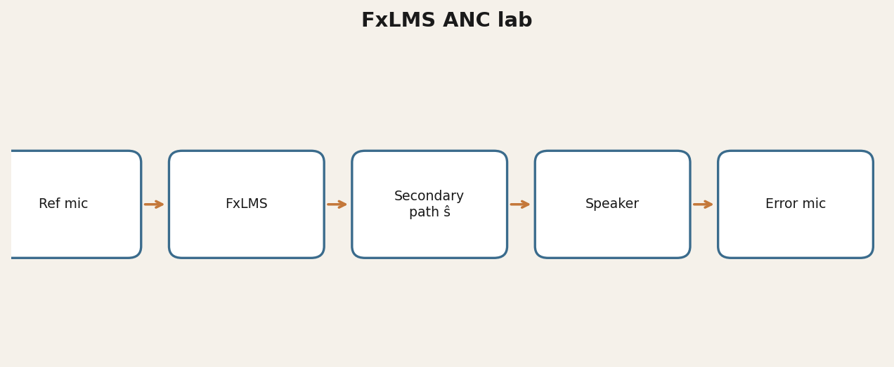

# FxLMS ANC Lab

Research lab for **active noise control** prototypes: offline FxLMS simulation, secondary-path IR measurement, and realtime experiments on Windows (WASAPI).

[](https://www.python.org/)
[](LICENSE)
[](https://glebvoronkov03.github.io/gleb-web-portfolio/projects/anc.html)

> Author: Gleb Voronkov · **Non-commercial research license** · Status: **research prototype**, not a shipping consumer product.

## Demo



## Why it matters
Speaker-mode ANC is physically constrained by latency and the λ/10 quiet zone. This repo documents measured secondary-path delay on a laptop bench, correct FxLMS structure notes, and measurement protocols — the kind of engineering that prevents false “AI magic” claims.

## Architecture



## Quickstart (simulation)
```powershell
cd python_proto
python -m venv .venv
# Windows: .\.venv\Scripts\Activate.ps1  |  Linux/macOS: source .venv/bin/activate
pip install -r requirements.txt
python src/fxlms_sim.py
```

See `docs/PROJECT_AUDIT.md` and `docs/RESEARCH_AUDITORY_SCIENCE.md` before expecting realtime cancellation.

## Results
- Secondary-path peak ≈ **43.7 ms @ 48 kHz** on the laptop bench (one IR capture)
- Offline FxLMS sim + WASAPI IR measurement tooling
- Science / hardware notes under `docs/`

## License & citation
Non-Commercial Research License (`LICENSE`). Commercial / product licensing: `mybook3@mail.ru` / `@Gleb_Voronkov`.

## Links
- Portfolio: [https://glebvoronkov03.github.io/gleb-web-portfolio/projects/anc.html](https://glebvoronkov03.github.io/gleb-web-portfolio/projects/anc.html)
- Related: [acoustic-localization](https://github.com/GlebVoronkov03/acoustic-localization)

## Disclaimer
Do not claim medical benefits or “room silence” from a phone speaker. Realistic near-term speaker ANC targets low-frequency drone near the device, often combined with masking.
